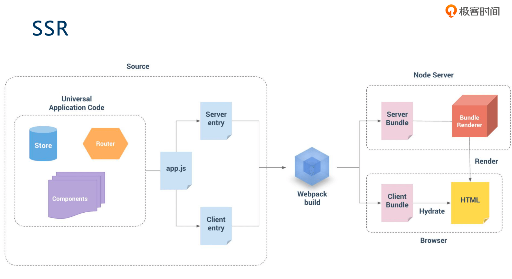

# 极客时间《Vue 开发实战》笔记

- [Vue 开发实战](https://time.geekbang.org/course/detail/163-86419)
- [课件和代码](https://github.com/geektime-geekbang/geektime-vue-1)

(这个课程讲得不错)

## 第一章：基础篇 (17 讲)

### 01 | 课程介绍

### 02 | Vue 简介

### 03 | 内容综述

### 04 | 第一个 Vue 程序

### 05 | 组件基础及组件注册

为什么在定义组件时 data 必须是函数，而不再是对象。因为它需要复用，如果 data 还是对象，这个对象是引用，在一个地方修改了就会全局被修改。

用 `Vue.component(name, ...)` 注册组件。

### 06 | Vue 组件的核心概念：事件

props 没法传函数？

父组件：`@delete="handleDelete"`

子组件：`this.$emit("delete", xxx)`

### 07 | Vue 组件的核心概：插槽

类似 react 中的 children

具名插槽，可以给插槽命名，传值

还是喜欢 jsx，而不是模板

### 08 | 理解单文件组件

@vue/cli

组件只在局部作用，如果还想全局生效，使用 Vue.component() 注册

### 09 | 双向绑定和单向数据流不冲突

v-model，仅仅是语法糖，还是单向数据流，相当于下面：

`<input :value="message" @input="handleChange"/>`

还可以用 `.sync`

### 10 | 理解虚拟 DOM 及 key 属性的作用

### 11 | 如何触发组件的更新

state/props 改变

watch, proxy (getter, setter)

### 12 | 合理应用计算属性和侦听器

- computed()
- watch()

我理解，computed 应该是纯函数，watch 可以执行副作用

computed vs watch:

1. computed 能做的, watch 都能做, 反之则不行
2. 优先使用 computed

- computed 对应 react useMemo()
- watch 对应 react useEffect()

### 13 | 生命周期的应用场景和函数式组件

created/render/mounted/updated/destroy

this.nextTick()

函数式组件，vue 也有这个了...

### 14 | 指令的本质是什么

不喜欢指令....

自定义指令的实现：bind / update / unbind ...

### 15 | 常用高级特性 provide/inject

类似 react 中的 context

### 16 | 如何优雅地获取跨层级组件实例（拒绝递归）

ref

callback ref

配合 provide/inject 使用

### 17 | template 和 JSX 的对比以及它们的本质

vue 也可以使用 jsx

对呀，示例很棒，我在 go template 里就遇到了，模板：

```vue
<h1 v-if="level===1">
  <slot></slot>
</h1>
<h2 v-else-if="level===2">
  <slot></slot>
</h2>
<h3 v-else-if="level===3>
...
```

啥玩意嘛

jsx:

```js
const Tag = `h${level}`
return <Tag>{this.\$slots.default}</Tag>
```

渲染函数：

```js
render: function(createElement) {
  return createElement("h"+this.level, this.$slots.default)
}
```

## 第二章：生态篇 (13 讲)

### 18 | 为什么需要 Vuex

Actions (异步) / Mutations (同步) / State

### 19 | 如何在 Vue 中使用 Vuex

Vue.use(Vuex)

- commit() 同步
- dispatch() 异步
- getter

### 20 | Vuex 核心概念及底层原理

```js
// https://github.com/geektime-geekbang/geektime-vue-1/blob/master/vuex-demo2/src/min-vuex.js
import Vue from 'vue'
const Store = function Store(options = {}) {
  const { state = {}, mutations = {} } = options
  this._vm = new Vue({
    data: {
      $$state: state,
    },
  })
  this._mutations = mutations
}
Store.prototype.commit = function (type, payload) {
  if (this._mutations[type]) {
    this._mutations[type](this.state, payload)
  }
}

Object.defineProperties(Store.prototype, {
  state: {
    get: function () {
      return this._vm._data.$$state
    },
  },
})
export default { Store }
```

`Vue.prototype.$store = store`

这一集有意思！

### 21 | Vuex 最佳实践

module / namespace

dispatch/commit 分开，挺好，比 redux 更清晰

### 22 | Vue Router 的使用场景

Vue.use(VueRouter)，内部注册了 `router-view`, `router-link` 等组件。

```js
<router-view>
<router-link>

$router.push()
```

### 23 | 选择何种模式的路由及底层原理

- hash: 瞄点失效，丑
- history: (ie9 不兼容?，需要后端配合？)

### 24 | Nuxt 解决了哪些问题？

对标 Next.js，SSR

### 25 | Nuxt 核心原理是什么？

SSR，配图不错



### 26 | UI 组件库对比：Element UI、Ant Design Vue、iView

### 27 | 提升开发效率和体验的常用工具：ESLint、Prettier、vue-devtools

vetur

vue-cli 已配置 eslint

### 28 | 单元测试的重要性及其使用

- jest/mocha
- @vue/test-utils
- sinon

shallowMount / Mount

哦，toMatchSnapshot () 原来是这么作用的啊。第一次测试时将结果持久化到一个文件中，后面每次测试的结果都和这个文件的内容进行对比。awesome! (前提是必须保证第一次的结果是正确的)

这一小节不错，学习了

组件的单元测试

### 29 | 生态篇习题解答（上）

### 30 | 生态篇习题解答（下）

## 第三章：实战篇 (21 讲)

以实现一个 ant design pro 为例，代码：https://github.com/vueComponent/ant-design-vue-pro (切换 tag 或 branch)

### 31 | Ant Design Pro 介绍

### 32 | 使用 Vue CLI 3 快速创建项目

### 33 | 如何自定义 Webpack 和 Babel 配置

修改 vue.config.js (比 CRA 修改 webpack 配置方便)

less-laoder, javascriptEnabled: true

bable-plugin-import，修改在 .babelrc 中

### 34 | 如何设计一个高扩展性的路由

`component: () => import(/* wepbackChunkName: "user" */ "./views/About.vue")`

原来注释是给 webpack 用的。webpackChunkName 是打包时候用的，你可以理解为它是给 webpack 的标志，打包的时候会把相同 name 标志的路由文件打包进一个文件中。

在页面切换时显示进度条：

```js
router.beforeEach(...NProgress.start())
router.afterEach(...NProgress.end())
```

soga!

### 35 | 实现一个可动态改变的页面布局

将选项放到 url 中 (theme 和 layout)

动态改变 theme 和布局

这一小节内容也很赞！

### 36 | 如何将菜单和路由结合

根据 route 配置，在左侧导航显示

左侧菜单的选中是通过判断 router path

vue-router 这个用起来比 react-router 方便

### 37 | 如何使用路由管理用户权限

router.beforeEach() 判断权限，跳转

渲染左侧导航时，check 权限，权限不够的不显示

### 38 | 更加精细化的权限设计（权限组件、权限指令）

实现 `<Authorized>` 组件，如果权限不够，则不显示 slot

另一种方式是自定义指令。

### 39 | 如何在组件中使用 ECharts、Antv 等其他第三方库

用 ref

`echarts.init(this.$refs.chartDom)`

监听 resize 事件

debounce，防抖

### 40 | 如何高效地使用 Mock 数据进行开发

proxy

### 47 | 如何定制主题及动态切换主题

不可以用 css 变量来实现吗？ (尝试)

### 48 | 如何做好国际化

moment 的语言包也要切换: `moment.locale(...)`

vue-i18n

### 50 | 如何构建可交互的组件文档

在组件下面同时显示组件的源码，用 raw-loader，wow，赞！

```html
<template>
  <div><Charts /></div>
  <div v-html="ChartsCode"></div>
</template>

<script>
  import Charts from './components/Charts'
  import ChartsCode from '!!raw-loader!./components/Charts'
  ...
</script>
```
